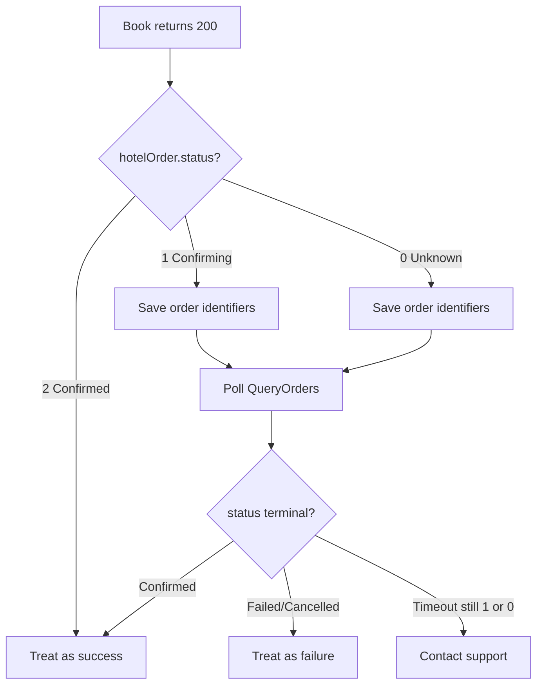

# Book API Error Handling and Order Status Guide

This document extends [OpenAPI Error Handling](https://openapi.hotelbyte.com/error-handling-7262582m0), focusing on **Book** API error scenarios, handling of non-terminal order statuses (Unknown, Confirming), and integration with QueryOrders and Cancel.

**Related API docs**: [Book API](https://openapi.hotelbyte.com/book-303257136e0)

---

## 1. Reading Guide

| Scenario | Section |
|----------|---------|
| Book returns HTTP errors (4xx/5xx, timeout) | 2. Book API Error Classification |
| Book returns 200 but `hotelOrder.status` is 0 or 1 | 3. Non-Terminal Status Handling |
| How to poll order status | 4. Polling and Timeout Strategy |
| Status enum quick reference | 5. Status Enum Quick Reference |
| Integration with QueryOrders and Cancel | 6. Integration with Other APIs |

---

## 2. Book API Error Classification

### 2.1 HTTP Error Responses

| HTTP Status | Error Type | Description | Client Recommendation |
|-------------|------------|-------------|------------------------|
| 400 | ParamErr | Invalid request parameters | Verify parameters and retry |
| 401 | AuthErr | Unauthorized | Check JWT or token |
| 403 | Forbidden | No permission | Check permission configuration |
| 404 | NotFoundErr | Resource not found (e.g. session expired) | Re-run CheckAvail flow |
| 429 | RateLimitErr | Rate limited | Reduce request frequency and retry |
| 504 | TimeoutErr | Upstream or supplier timeout | See 2.3 Timeout Handling |

### 2.2 BookFailureStatus (Business failure, returns 4xx, no hotelOrder)

When a recognizable failure occurs during Book, the platform returns **4xx** with response body possibly containing `bookFailureStatus` and `message` (implementation-dependent). Reference for platform failure statuses:

| bookFailureStatus | Meaning | Description |
|-------------------|---------|-------------|
| 1 | NotCreated | Order was never created. Typically Phase 2 did not find the order |
| 2 | CreatedAndCancelled | Order was created and synchronously cancelled (e.g. after timeout confirmation when client already timed out) |
| 3 | CreatedNeedCancel | Order was created but cancellation failed; platform will retry asynchronously |

**Client handling**: On 4xx, use `message` or error code. If `CreatedNeedCancel`, the order may still exist; call QueryOrders with `platformReferenceNo` or `customerReferenceNo` to verify.

### 2.3 Timeout (504 TimeoutErr)

**Scenario**: Book request did not complete within client `Timeout-Milliseconds`, or upstream/supplier response timed out.

**Platform behavior**: Platform initiates "post-timeout confirmation" (Phase 1 / Phase 2):  
- Phase 1: Poll supplier within ~180 seconds to confirm if order was created  
- Phase 2: If not found, continue polling within ~10 minutes; if found, attempt synchronous cancellation  

**Client recommendations**:
1. Do **not** treat 504 as failure immediately
2. Call **QueryOrders** with `customerReferenceNo` to verify order status
3. If order found and status is Confirmed, treat as success; if Cancelled/Failed, treat as terminal

---

## 3. Non-Terminal Status Handling (status 0 and 1)

When Book returns **HTTP 200** and `data.hotelOrder` exists, the order was created. Next actions depend on `hotelOrder.status`.

### 3.1 Status 1 (Confirming)

**Meaning**: Supplier has received the booking request and is confirming; order is created.

**Platform internal behavior**: `internalStatus` is `NeedSupplierConfirm` (3). Platform may create a fetch_hcn task to obtain hotel confirmation number.

**Recommended actions**:

1. **Accept 200 response**: Order is created; save `platformReferenceNo`, `customerReferenceNo`, `supplierReferenceNo`
2. **Poll QueryOrders**: Use `platformReferenceNo` or `customerReferenceNo` until status becomes terminal (Confirmed=2 or Failed/Cancelled/CancelFailed)
3. **Timeout strategy**: Poll for 5–10 minutes; if still Confirming, extend or contact support
4. **UI**: Show "Awaiting supplier confirmation"; do not promise "confirmed" to user

### 3.2 Status 0 (Unknown)

**Meaning**: Supplier returned unknown status; may indicate async confirmation, parsing error, or undefined state.

**Platform internal behavior**: Unknown is currently mapped to `OrderStateCancelFailed` (10) as a pessimistic default.

**Recommended actions**:

1. **Accept 200 response**: Order may have been created; save order identifiers
2. **Poll QueryOrders promptly**: Use `platformReferenceNo` to get latest status
3. **If still Unknown after multiple polls**: Contact platform or supplier support; do not treat as failure directly
4. **UI**: Show "Status unknown, verifying"; guide user to check later or contact support

### 3.3 Generic Flow (including timeout)



---

## 4. Polling and Timeout Strategy

### 4.1 API Choice

Use **QueryOrders** (`POST /api/trade/queryOrders`) for order status:

- `platformReferenceNo`: Platform order ID (from `hotelOrder.platformReferenceNo` in Book response)
- `customerReferenceNo`: Customer reference (from Book request)

### 4.2 Recommended Polling Strategy

| Phase | Interval | Notes |
|-------|----------|-------|
| First | Immediate | Confirm order is persisted |
| 2nd–3rd | 30 seconds | For Confirming/Unknown, use shorter interval |
| Subsequent | 1–2 minutes | Increase gradually to avoid excessive calls |
| Timeout | 5–10 minutes | If still non-terminal, contact support |

### 4.3 Terminal Status

Stop polling when `hotelOrder.status` is one of:

- `2` (Confirmed): Success
- `3` (Cancelled): Cancelled
- `4` (Failed): Failed
- `5` (CancelFailed): Cancel failed

---

## 5. Status Enum Quick Reference

### 5.1 OrderStatus (hotelOrder.status, API response)

| Value | Meaning | Terminal |
|-------|---------|----------|
| 0 | Unknown | No |
| 1 | Confirming | No |
| 2 | Confirmed | Yes |
| 3 | Cancelled | Yes |
| 4 | Failed | Yes |
| 5 | CancelFailed | Yes |

### 5.2 InternalOrderStatus (platform internal, for reference)

| Value | Meaning |
|-------|---------|
| 1 | Created |
| 2 | Paid |
| 3 | NeedSupplierConfirm |
| 4 | Confirmed |
| 5 | Completed |
| 6 | Cancelled |
| 7 | NeedCancel |
| 8 | NeedRefund |
| 9 | Failed |
| 10 | CancelFailed |

### 5.3 Supplier → Internal Mapping (Book response)

| hotelOrder.status | InternalOrderStatus |
|-------------------|---------------------|
| 0 (Unknown) | 10 (CancelFailed) |
| 1 (Confirming) | 3 (NeedSupplierConfirm) |
| 2 (Confirmed) | 4 (Confirmed) |
| 3 (Cancelled) | 6 (Cancelled) |
| 4 (Failed) | 9 (Failed) |
| 5 (CancelFailed) | 10 (CancelFailed) |

---

## 6. Integration with Other APIs

### 6.1 QueryOrders

- **Purpose**: Order status query, post-timeout confirmation, polling for status 0/1
- **Key params**: `platformReferenceNo`, `customerReferenceNo`, `statusList` (optional)
- **Docs**: https://openapi.hotelbyte.com/queryOrders (refer to actual OpenAPI docs)

### 6.2 Cancel

- **Purpose**: Cancel orders in Confirming, Confirmed, Failed (cancellable states)
- **Precondition**: Order must be in a cancellable state
- **Docs**: https://openapi.hotelbyte.com/cancel (refer to actual OpenAPI docs)

### 6.3 Full Booking Flow

```
1. Search (HotelRates)
2. Select (user selects rate package)
3. Verify (CheckAvail)
4. Book ← focus of this document
5. Confirm (poll QueryOrders until terminal)
```

---

## Appendix: Change Log

| Date | Changes |
|------|---------|
| 2026-02-12 | Initial: Book error handling, Status 0/1 handling, polling strategy, status quick reference |
