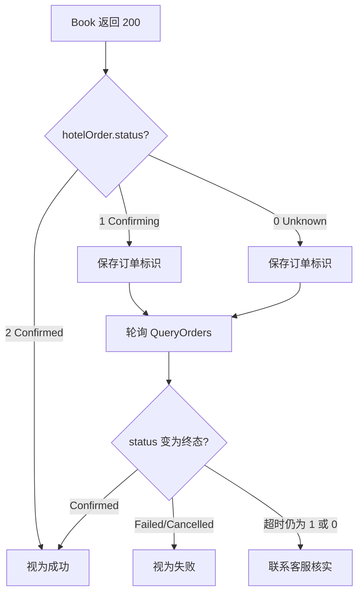

# Book API 错误处理与订单状态指南

本文档是 [OpenAPI Error Handling](https://openapi.hotelbyte.com/error-handling-7262582m0) 的扩展版本，专门针对 **Book** 接口的错误场景、非终态订单状态（Unknown、Confirming）的处理建议，以及与 QueryOrders、Cancel 的衔接说明。

**相关接口文档**：[Book API](https://openapi.hotelbyte.com/book-303257136e0)

---

## 一、阅读指引

| 场景 | 章节 |
|------|------|
| Book 返回 HTTP 错误（4xx/5xx、超时） | 二、Book 接口错误分类 |
| Book 返回 200 但 `hotelOrder.status` 为 0 或 1 | 三、非终态 Status 处理 |
| 如何轮询订单状态 | 四、轮询与超时策略 |
| 状态枚举速查 | 五、状态枚举速查表 |
| 与 QueryOrders、Cancel 的配合 | 六、与其他接口的衔接 |

---

## 二、Book 接口错误分类

### 2.1 HTTP 错误响应

| HTTP 状态码 | 错误类型 | 说明 | 客户端建议 |
|-------------|----------|------|------------|
| 400 | ParamErr | 请求参数错误 | 检查参数后重试 |
| 401 | AuthErr | 未授权 | 检查 JWT 或 token |
| 403 | Forbidden | 无权限 | 检查权限配置 |
| 404 | NotFoundErr | 资源不存在（如 session 过期） | 重新走 CheckAvail 流程 |
| 429 | RateLimitErr | 限流 | 降低请求频率后重试 |
| 504 | TimeoutErr | 上游或供应商超时 | 见 2.3 超时处理 |

### 2.2 BookFailureStatus（业务失败，返回 4xx，不包含 hotelOrder）

当 Book 调用过程中发生可识别的失败时，平台返回 **4xx** 错误，响应体中可能包含 `bookFailureStatus` 和 `message` 字段（具体取决于实现）。以下为平台内部使用的失败状态，供参考：

| bookFailureStatus | 含义 | 说明 |
|-------------------|------|------|
| 1 | NotCreated | 订单完全未创建。通常为 Phase 2 未找到订单，判定下单失败 |
| 2 | CreatedAndCancelled | 订单已创建且同步取消成功（如超时后确认订单存在但客户端已超时） |
| 3 | CreatedNeedCancel | 订单已创建但取消失败，需平台异步重试取消 |

**客户端处理**：收到 4xx 时，根据 `message` 或错误码判断。若为 `CreatedNeedCancel`，订单可能仍存在，建议用 `platformReferenceNo` 或 `customerReferenceNo` 调用 QueryOrders 核实。

### 2.3 超时（504 TimeoutErr）

**场景**：Book 请求在客户端设定的 `Timeout-Milliseconds` 内未能完成，或上游/供应商响应超时。

**平台行为**：平台会启动「超时后确认」流程（Phase 1 / Phase 2）：  
- Phase 1：在约 180 秒内轮询供应商，确认订单是否成功创建  
- Phase 2：若仍未找到，继续在约 10 分钟内轮询；若找到则尝试同步取消  

**客户端建议**：
1. 收到 504 后，**不要**立即视为失败
2. 使用 `customerReferenceNo` 调用 **QueryOrders** 核实订单状态
3. 若找到订单且 status 为 Confirmed，视为成功；若为 Cancelled/Failed 等，按终态处理

---

## 三、非终态 Status 处理（status 0 与 1）

当 Book 返回 **HTTP 200** 且 `data.hotelOrder` 存在时，订单已创建。此时需根据 `hotelOrder.status` 决定后续动作。

### 3.1 Status 1 (Confirming)

**含义**：供应商已接收预订请求，正在确认中，订单已创建。

**平台内部行为**：`internalStatus` 为 `NeedSupplierConfirm`（3），平台可能创建 fetch_hcn 任务以获取酒店确认号。

**推荐动作**：

1. **接受 200 响应**：订单已创建，保存 `platformReferenceNo`、`customerReferenceNo`、`supplierReferenceNo`
2. **轮询 QueryOrders**：使用 `platformReferenceNo` 或 `customerReferenceNo` 轮询，直到 status 变为终态（Confirmed=2 或 Failed/Cancelled/CancelFailed）
3. **超时策略**：建议 5–10 分钟内轮询，若仍为 Confirming，可适当延长或联系客服
4. **UI 展示**：显示「待供应商确认」，避免对用户承诺「已确认」

### 3.2 Status 0 (Unknown)

**含义**：供应商返回状态未知，可能是异步确认、解析异常或未定义状态。

**平台内部行为**：当前将 Unknown 映射为 `OrderStateCancelFailed`（10），采用悲观处理。

**推荐动作**：

1. **接受 200 响应**：订单可能已创建，保存订单标识信息
2. **立即轮询 QueryOrders**：尽快用 `platformReferenceNo` 获取最新状态
3. **若多次轮询仍为 Unknown**：联系平台客服或供应商核实，避免直接视为失败
4. **UI 展示**：显示「状态未知，正在核实」，引导用户稍后查看或联系客服

### 3.3 通用流程（含超时场景）



---

## 四、轮询与超时策略

### 4.1 接口选择

使用 **QueryOrders**（`POST /api/trade/queryOrders`）进行订单状态查询：

- `platformReferenceNo`：平台订单号（Book 返回的 `hotelOrder.platformReferenceNo`）
- `customerReferenceNo`：客户参考号（Book 请求中的 `customerReferenceNo`）

### 4.2 推荐轮询策略

| 阶段 | 间隔 | 说明 |
|------|------|------|
| 首次 | 立即 | 确认订单是否已写入 |
| 第 2–3 次 | 30 秒 | 若为 Confirming/Unknown，可短间隔 |
| 后续 | 1–2 分钟 | 逐步拉长，避免过于频繁 |
| 超时 | 5–10 分钟 | 若仍为非终态，可联系客服 |

### 4.3 终态判断

当 `hotelOrder.status` 为以下之一时，可停止轮询：

- `2` (Confirmed)：成功
- `3` (Cancelled)：已取消
- `4` (Failed)：失败
- `5` (CancelFailed)：取消失败

---

## 五、状态枚举速查表

### 5.1 OrderStatus（hotelOrder.status，API 响应）

| 值 | 含义 | 是否终态 |
|----|------|-----------|
| 0 | Unknown | 否 |
| 1 | Confirming | 否 |
| 2 | Confirmed | 是 |
| 3 | Cancelled | 是 |
| 4 | Failed | 是 |
| 5 | CancelFailed | 是 |

### 5.2 InternalOrderStatus（平台内部状态，供参考）

| 值 | 含义 |
|----|------|
| 1 | Created |
| 2 | Paid |
| 3 | NeedSupplierConfirm |
| 4 | Confirmed |
| 5 | Completed |
| 6 | Cancelled |
| 7 | NeedCancel |
| 8 | NeedRefund |
| 9 | Failed |
| 10 | CancelFailed |

### 5.3 Supplier → Internal 映射（Book 响应）

| hotelOrder.status | InternalOrderStatus |
|-------------------|---------------------|
| 0 (Unknown) | 10 (CancelFailed) |
| 1 (Confirming) | 3 (NeedSupplierConfirm) |
| 2 (Confirmed) | 4 (Confirmed) |
| 3 (Cancelled) | 6 (Cancelled) |
| 4 (Failed) | 9 (Failed) |
| 5 (CancelFailed) | 10 (CancelFailed) |

---

## 六、与其他接口的衔接

### 6.1 QueryOrders

- **用途**：订单状态查询、超时后确认、status 0/1 的轮询
- **关键参数**：`platformReferenceNo`、`customerReferenceNo`、`statusList`（可选）
- **文档**：https://openapi.hotelbyte.com/queryOrders（以实际 OpenAPI 文档为准）

### 6.2 Cancel

- **用途**：取消处于 Confirming、Confirmed、Failed 等可取消状态的订单
- **前提**：订单状态在可取消范围内（Confirming、Confirmed、Failed）
- **文档**：https://openapi.hotelbyte.com/cancel（以实际 OpenAPI 文档为准）

### 6.3 完整预订流程

```
1. Search (HotelRates)
2. Select (用户选择 rate package)
3. Verify (CheckAvail)
4. Book ← 本文档重点
5. Confirm (QueryOrders 轮询直至终态)
```

---

## 附录：变更记录

| 日期 | 内容 |
|------|------|
| 2026-02-12 | 初版：扩展 Book 错误处理、Status 0/1 处理建议、轮询策略、状态速查表 |
